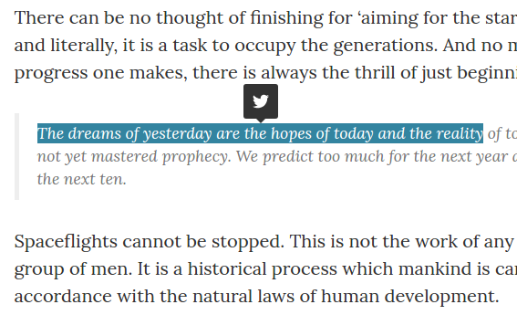
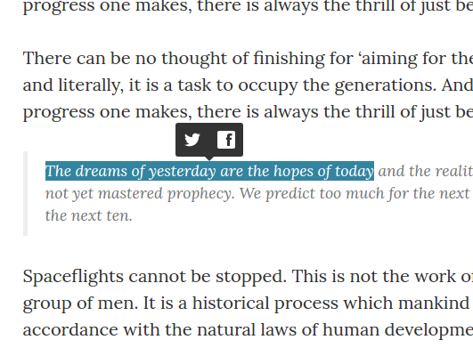
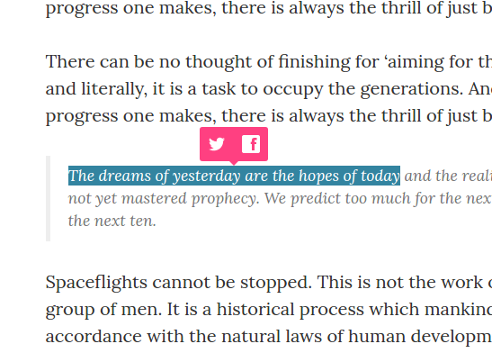

<p align="center">
  
</p>

<p align="center">
  Share selection text
</p>

<p align="center">
  <a href="https://www.npmjs.com/package/sharect"></a>
  <a href="https://github.com/estevanmaito/sharect"></a>

  <a href="https://github.com/estevanmaito/sharect"></a>
</p>

A **light** (3.4kb) library to let users share their text selections to social networks, in desktop browsers. (Yes, like Medium)

## Packages

| Package | Version | Description |
|---------|---------|-------------|
|sharect|<a href="https://www.npmjs.com/package/sharect"></a>|No dependencies, plug-n-play|
|sharect-react|Soon|React.js plugin|
|sharect-vue|Soon|Vue.js plugin|
|sharect-chrome|Soon|Chrome extension|

## Usage

### NPM

```
npm install sharect
```

### Script

[Download]()

Add the script to the project and initialize

```html
<script src="sharect.min.js"></script>
<script>
  var sharect = new Sharect();
  sharect.init();
</script>
```

More use cases below.

## Docs

### Default settings

- ```twitter: true```
- ```facebook: false```
- ```twitterUsername: false```
- ```backgroundColor: #333333```
- ```iconColor: #FFFFFF```

```html
  ...
  <script src="sharect.min.js"></script>
  <script>
    var sharect = new Sharect();
    sharect.init();
  </script>
</body>
```

Result



### Facebook share

If you want Facebook share to work, first you will need to add the JavaScript SDK **before** Sharect's script initialization. Read more about [Facebook Share SDK](https://developers.facebook.com/docs/javascript/quickstart#loading).

```html
  ...
  <!-- BEGIN: Facebook JavaScript SDK -->
  <script>
    window.fbAsyncInit = function() {
      FB.init({
        appId      : 'YOUR-APP-ID',
        xfbml      : true,
        version    : 'v2.8'
      });
      FB.AppEvents.logPageView();
    };

    (function(d, s, id){
      var js, fjs = d.getElementsByTagName(s)[0];
      if (d.getElementById(id)) {return;}
      js = d.createElement(s); js.id = id;
      js.src = "https://connect.facebook.net/en_US/sdk.js";
      fjs.parentNode.insertBefore(js, fjs);
    }(document, 'script', 'facebook-jssdk'));
  </script>
  <!-- END: Facebook JavaScript SDK -->
  <script src="sharect.min.js"></script>
  <script>
    var sharect = new Sharect();
    sharect.config({
      facebook: true
    }).init();
  </script>
</body>
```

Result



### Complete API

Assuming you already added the above Facebook SDK script.

```html
  ...
  <script src="sharect.min.js"></script>
  <script>
    var sharect = new Sharect();
    sharect.config({
      facebook: true,
      twitter: true,
      twitterUsername: '@estevanmaito',
      backgroundColor: '#ff4081',
      iconColor: '#fff'
    }).init();
  </script>
</body>
```

Note that ```twitter``` is ```true``` by default, as ```iconColor``` is ```#ffffff```. This example just exposes the available API.

Result

